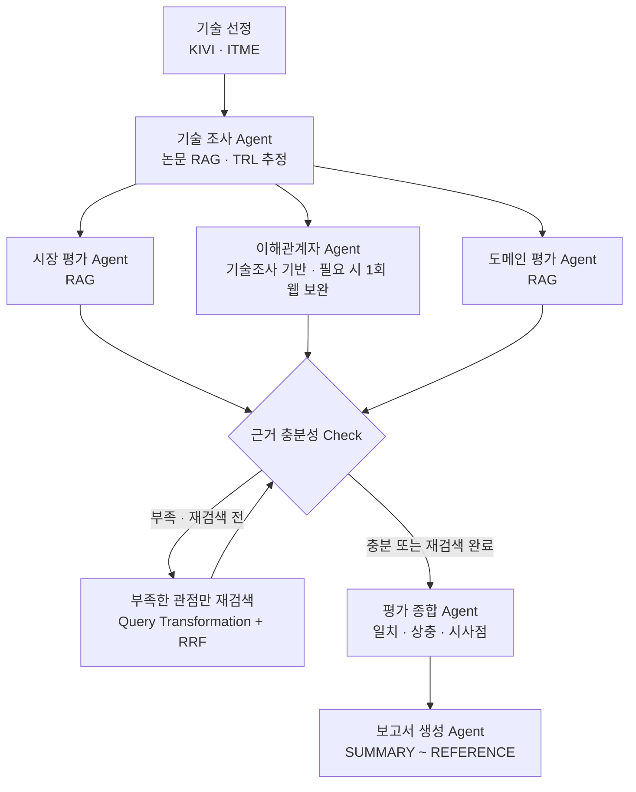

# KV Cache 최적화 기술 다관점 평가 Agentic RAG

KV Cache 메모리 병목을 해결하는 두 접근, **SW 압축(KIVI)**과 **HW 메모리 확장(ITME)**을
동일한 Cloud/Data Center Long-context LLM Serving 환경에서 비교하는 프로젝트입니다.
LangGraph 기반 Multi-Agent가 기술·시장성·이해관계자·도메인 관점의 근거를 각각 수집하고,
관점 간 공통점과 상충점을 종합해 중립적인 평가 보고서를 생성합니다.

> 목표는 우수 기술을 선정하는 것이 아니라, 적용 조건과 이해관계자에 따라 평가가 어떻게
> 달라지는지 근거와 함께 설명하는 것입니다.

## 1. 문제 정의와 기술 선정

LLM은 토큰 생성 과정에서 이전 Key·Value를 KV Cache에 저장해 연산 중복을 줄입니다.
하지만 문맥 길이와 동시 요청이 증가하면 KV Cache가 GPU HBM을 빠르게 점유하면서
메모리 용량과 데이터 이동이 추론 병목으로 바뀝니다.

Cloud/Data Center Long-context LLM Serving은 긴 문맥과 높은 동시성으로 KV Cache의
메모리 용량 및 데이터 이동 병목이 크게 나타나는 환경입니다. 또한 KIVI의 소프트웨어
압축 효과와 ITME의 하드웨어 메모리 확장 효과를 Memory·Latency·Throughput·Quality·
Infrastructure라는 공통 기준으로 함께 평가할 수 있어 대상 도메인으로 선정했습니다.

| 구분         | KIVI                                      | ITME                                            |
| ------------ | ----------------------------------------- | ----------------------------------------------- |
| 해결 계층    | Software                                  | Hardware / Memory System                        |
| 핵심 접근    | 비대칭 2-bit 양자화로 KV Cache 크기 축소  | CXL-Hybrid 계층형 메모리로 가용 용량 확장       |
| 주요 평가 축 | 메모리 절감·처리량·품질 변화              | 용량·지연시간·처리량·인프라 비용                |
| 선정 이유    | 공개 논문·구현·정량 실험을 통한 평가 가능 | 프로토타입·성능 검증 및 CXL 도입 부담 평가 가능 |

두 기술은 동일한 문제를 서로 다른 계층에서 해결하므로, 직접적인 우열보다
**Memory·Latency·Throughput·Quality·Infrastructure의 조건별 trade-off**를 분석하기 적합합니다.
기술 선정은 사전 평가 기준에 따른 Human-based Selection으로 고정했습니다.

## 2. 핵심 차별점

1. **동일 도메인에서의 Cross-layer 비교**  
   SW 최적화와 HW 확장을 Cloud/Data Center Long-context LLM Serving이라는 같은 환경과
   같은 평가 축으로 비교합니다.

2. **독립적인 관점 평가와 중립적 종합**  
   시장성·이해관계자·도메인 에이전트가 서로 다른 State 키에 결과를 기록하고,
   종합 에이전트가 일치점·상충점·시사점을 구분합니다. 모든 프롬프트에 우열 판정 금지를 명시했습니다.

3. **근거 부족을 통제하는 Agentic RAG**
   기술·시장 결과의 근거 부족 표지와 도메인 평가의 구조화된 `evidence_gaps`를 확인해,
   부족한 RAG 관점만 최대 1회 재검색합니다. 재검색에서는 Query Transformation과 RRF를
   적용해 검색 범위를 넓히며, 무한 반복은 방지합니다.

4. **검색 성능을 수치로 검증**  
   한국어 질문으로 영문 논문을 검색하는 실제 사용 조건에서 Dense Top-K와
   Query Transformation + RRF를 Hit Rate@5·MRR@5로 비교했습니다.

5. **LLM이 아닌 코드로 REFERENCE를 통제**
   보고서 본문의 인용 ID를 검증하고, 등록된 출처 중 본문에서 인용된 자료만 코드로
   REFERENCE에 구성합니다. 누락된 서지 정보나 출처가 아닌 값은 경고로 남깁니다.

## 3. 시스템 구조



시장·이해관계자·도메인 평가는 fan-out으로 병렬 실행하고 각각 `market_result`,
`stakeholder_result`, `domain_result`에 기록합니다. 세 결과가 모두 완료되면 fan-in으로
근거 충분성을 검사하므로 병렬 State 충돌을 피하면서 전체 실행 시간을 줄입니다.
이해관계자 에이전트는 자체적으로 근거 부족 항목만 최대 1회 웹 검색으로 보완하므로,
Evidence Check의 RAG 재검색 대상에는 포함하지 않습니다.

## 4. 에이전트 구성

| 에이전트 | RAG | 역할 및 출력 |
| --- | :---: | --- |
| 기술 선정 | X | 기본값은 팀의 Human-based 선정값 KIVI·ITME, 필요 시 `auto_select=True`로 후보 풀에서 자동 선정 |
| 기술 조사 | O | 논문에서 원리·범위·한계·TRL 근거 추출 |
| 시장 평가 | O | 시장 수요·채택·생태계·경제성·도입 장벽 평가 |
| 이해관계자 평가 | X | 기술조사 근거로 5개 이해관계자 관점을 평가하고, 직접 근거가 부족한 항목만 Tavily 웹 검색 1회로 보완 |
| 도메인 평가 | O | Memory·Latency·Throughput·Quality·Infrastructure 평가 |
| 근거 충분성 Check | X | 기술·시장 결과의 부족 표지와 도메인의 `evidence_gaps`를 규칙으로 검사하고 재검색 여부 결정 |
| 평가 종합 | X | 관점 간 공통점·상충점·조건부 시사점 도출 |
| 보고서 생성 | X | 필수 목차·본문 인용을 검증하고, 프로젝트 입력 PDF 전체를 REFERENCE로 생성 |

## 5. RAG 설계와 검증

- Document: KIVI·ITME 원 논문, 시장 평가 보조 문서, 도메인 기준 문서(PagedAttention·LongBench)
- Parser: `PyPDFLoader`
- Splitter: `RecursiveCharacterTextSplitter` (`chunk_size=1500`, `overlap=200`)
- Embedding: `BAAI/bge-m3`의 Dense embedding
- Vector DB: FAISS, 기술별 인덱스 분리
- Baseline: Dense Retrieval + Top-K
- 재검색 전략: Query Transformation + Reciprocal Rank Fusion(RRF)

원문 논문은 기술 조사와 기술별 도메인 평가의 근거로 사용하고, 시장·도메인 에이전트는
자신의 평가 목적에 맞는 보조 문서를 별도 인덱스로 구성합니다.

### 인덱싱 문서와 페이지 수

| 용도 | 파일 | 페이지 |
| --- | --- | ---: |
| 기술 조사·기술별 평가 | `sw_kivi.pdf` | 15 |
| 기술 조사·기술별 평가 | `hw_itme.pdf` | 13 |
| KIVI 시장 평가 | `market_hf_kv_cache.pdf` | 6 |
| ITME 시장 평가 | `market_micron_amd_cxl_memory_expansion.pdf` | 6 |
| 도메인 평가 | `PagedAttention.pdf` | 16 |
| 도메인 평가 | `LongBench.pdf` | 19 |
| 도메인 평가 | `DistServe.pdf` | 18 |
| **고유 문서 합계** | **7개 PDF** | **93** |

현재 데이터 풀은 고유 문서 기준 7개·93쪽으로, 페이지
절단 없이 전부 인덱싱합니다. 평가 목적별로 인덱스를 분리하기 때문에 KIVI·ITME 원문은
기술 인덱스와 시장 인덱스에서 각각 재사용됩니다. 이 중복 처리까지 포함한 인덱스별 누적
페이지는 121쪽이지만, 실제 사용한 고유 원문은 93쪽입니다. 페이지 수는 현재 `data/`에
저장된 PDF를 기준으로 산정했습니다.

`BAAI/bge-m3`는 한국어 질의와 영어 논문 사이의 cross-lingual retrieval, 긴 문맥 지원,
향후 Sparse·Multi-vector 검색 확장 가능성을 기준으로 선정했습니다. 현재 구현은
`HuggingFaceEmbeddings`를 통한 Dense embedding만 사용합니다.

### Retrieval 평가 결과

현재 KIVI·ITME PDF로 새 인덱스를 만든 뒤 한국어 질의 14개(KIVI 7개, ITME 7개)를
평가했습니다. 검색된 단일 청크에 해당 질의의 gold keyword가 모두 있으면 적중으로
간주하는 키워드 기반 평가입니다.

| 전략                       | Hit Rate@5 |  MRR@5 |
| -------------------------- | ---------: | -----: |
| Dense Top-K                |      0.857 |  0.738 |
| Query Transformation + RRF |      0.857 |  0.631 |
| 변화량                     |     +0.000 | -0.107 |

이번 실행에서 두 전략의 적중률은 같았고, 질의 변환 후 MRR@5는 낮아졌습니다.
따라서 질의 변환을 전체 검색의 기본값으로 사용하지 않고 근거 부족 시 재검색에만
선택적으로 적용합니다. 키워드 일치만으로 근거의 의미적 적합성을 확정할 수는 없으며,
재검색 전략의 효과는 추가 평가가 필요합니다.

## 6. 최종 평가 보고서의 핵심 포인트

- KIVI는 tuning-free 비대칭 2bit 양자화로 KV Cache를 축소합니다. 원문 실험에서는 peak memory
  약 2.6× 절감, 최대 4× 큰 batch 허용, throughput 2.35→3.47× 향상이 보고됐습니다. 반면
  그룹 크기·residual 길이의 설정 민감도, 일부 모델의 품질 저하, 런타임 오버헤드는 함께 검증해야 합니다.
- ITME는 CXL-hybrid 원격 메모리와 multi-tier DMA 프리페칭으로 TB급 용량 확장을 지향합니다.
  일부 워크로드에서 최대 35.7%의 throughput 향상과 turn 5 기준 1.81× 개선이 보고됐습니다.
  다만 I/O contention, 대역폭 변동, weight miss에 따른 pipeline stall은 주요 운영 검증 항목입니다.
- 두 기술의 TRL은 논문·프로토타입·실험 근거를 바탕으로 대략 4~6으로 추정했습니다. 이는 공개
  자료 기반 범위이며 확정 등급이 아닙니다. 시장 규모·상용 채택·TTFT/TPOT·Cost/Token·전력 및
  광범위한 프레임워크 통합 근거는 현재 입력만으로 확인하기 어렵습니다.
- 기술적 성능 향상이 곧 시장 채택을 의미하지 않습니다. 품질 변화, 프레임워크 호환성,
  CXL 인프라 비용, 운영 복잡도처럼 도입 주체별 판단 기준을 함께 봐야 합니다.
- KIVI와 ITME의 성능 수치는 모델·하드웨어·문맥 길이·부하와 평가 지표가 서로 달라 직접 비교할 수
  없습니다. 기존 GPU에서의 단기 파일럿과 TB급 장문맥을 위한 장기 인프라 검증처럼 적용 조건에
  따라 검증 순서와 핵심 지표를 달리해야 합니다.
- 결론은 기술의 우열보다 “어떤 환경에서 어떤 효익과 부담이 커지는가”에 초점을 둡니다.

최종 보고서는 `SUMMARY → 분석 배경 → 기술 선정 → 기술 개요 → 관점별 평가 → 시사점 →
한계점 → REFERENCE` 순서로 생성되며 `outputs/report_*.md`에 저장됩니다.

보고서 본문은 `[src_xxx]` 형태의 출처 ID로 인용합니다. 보고서 생성 에이전트는
LLM이 임의로 만든 REFERENCE 섹션을 제거한 뒤, `data/`에 실제로 있는 프로젝트 입력 PDF를
구조화된 서지정보로 모두 추가합니다.

## 7. Lessons Learned

- Multi-Agent의 가치는 에이전트 수보다 **역할과 State 책임을 분리하는 설계**에서 나왔습니다.
  병렬 에이전트가 서로 다른 키에 쓰게 하니 fan-out/fan-in을 안정적으로 구성할 수 있었습니다.
- RAG 검색 전략의 효과는 질의와 문서에 따라 달랐습니다. 이번 키워드 기반 평가에서
  질의 변환과 결과 융합은 적중률을 높이지 못했고 MRR@5도 낮아졌습니다.
- 근거가 없을 때 LLM이 답을 채우게 두기보다, 부족함을 감지해 필요한 관점만 다시 검색하는
  흐름이 비용과 신뢰성 사이에서 더 현실적인 선택이었습니다.
- SW와 HW 기술은 하나의 점수로 공정하게 비교하기 어렵습니다. 공통 도메인과 평가 축을 먼저
  고정하고, 일치·상충·비교 불가를 구분하는 과정이 중립적인 종합에 중요했습니다.
- 공개 논문은 기술 원리와 실험 성능에는 강하지만 실제 도입 비용·고객 운영·시장 채택 정보에는
  한계가 있습니다. 보고서에서는 TRL과 상용화 판단을 공개 정보 기반 추정으로 명시합니다.

## 8. 실행 방법

### 요구사항

- Python 3.11 권장
- OpenAI API key
- KIVI·ITME 논문 PDF 및 관점별 보조 문서

```bash
conda create -n rag python=3.11
conda activate rag
pip install -r requirements.txt
```

프로젝트 루트에 `.env` 파일을 생성합니다.

```dotenv
OPENAI_API_KEY=your-api-key
LLM_MODEL=gpt-5-mini
EMBEDDING_MODEL=BAAI/bge-m3
# 이해관계자 근거 보완 웹 검색을 사용하려면 추가
TAVILY_API_KEY=your-tavily-api-key
```

전체 RAG 평가를 실행하려면 아래 문서를 `data/`에 저장합니다. 앞의 두 파일은 기술 조사의
핵심 원문이며, 나머지는 시장·도메인 평가를 위한 보조 문서입니다.

```text
data/sw_kivi.pdf
data/hw_itme.pdf
data/market_hf_kv_cache.pdf
data/market_micron_amd_cxl_memory_expansion.pdf
data/PagedAttention.pdf
data/LongBench.pdf
data/DistServe.pdf
```

`DistServe.pdf`는 latency 관점에서 TTFT·TPOT와 prefill/decode 분리 설계를 평가하는
도메인 참고 문서로 사용합니다.

전체 파이프라인을 실행합니다.

```bash
python app.py
```

평가 도메인을 변경해 실험하려면 다음 옵션을 사용합니다.

```bash
python app.py --domain "OnDevice AI"
```

Retrieval 평가만 다시 실행하려면:

```bash
python -m rag.evaluate --k 5
```

보고서·REFERENCE 검증 테스트는 다음과 같이 실행합니다.

```bash
python -m unittest discover -s tests -p "test_*.py"
```

실행 결과는 다음 위치에 생성됩니다.

```text
outputs/report_YYYYMMDD_HHMMSS.md
outputs/rag_eval_YYYYMMDD_HHMMSS.md
```

PDF가 없으면 후보 메타데이터 요약으로 파이프라인을 계속 실행하지만, 원문 RAG와
Retrieval 평가는 수행할 수 없습니다.

## 9. 프로젝트 구조

```text
├── agents/             # 선정·조사·평가·근거검증·종합·보고서 Agent
├── data/               # KIVI·ITME 원문 PDF
├── faiss_index/        # 자동 생성되는 기술별 FAISS 인덱스
├── outputs/            # 평가 보고서와 Retrieval 평가 결과
├── prompts/            # Agent별 프롬프트
├── rag/                # PDF 적재·검색·질의 변환·Retrieval 평가
├── tests/              # 보고서 구조·인용·REFERENCE 검증 테스트
├── tools/              # 이해관계자 근거 보완 웹 검색 도구
├── app.py              # 실행 진입점
├── candidates.py       # 기술 후보와 팀 최종 선정값
├── graph.py            # LangGraph 노드·엣지 정의
├── llm.py              # 생성 LLM·Embedding 팩토리
├── state.py            # 공용 GraphState 스키마
└── requirements.txt
```

## 10. 현재 한계와 개선 방향

- Retrieval 정답 판정은 수작업 relevance label 대신 gold keyword 일치 여부를 사용합니다.
  후속 평가에서는 문맥 적합성 라벨과 nDCG 같은 순위 지표를 함께 사용할 수 있습니다.
- 이해관계자 정보는 외부 출처에 분산되고 빠르게 변합니다. 현재 웹 검색 결과가 없으면
  일반 지식으로 채우지 않고, 기술 조사 기반 분석을 유지하며 직접 근거가 없는 항목은
  `Insufficient Evidence`로 남깁니다.
- REFERENCE는 코드가 본문 인용과 State의 `sources`, 그리고 `data/`의 프로젝트 PDF를 대조해 생성합니다. 다만 일부
  에이전트는 아직 문자열·basis 라벨 형태의 출처를 반환하므로, 모든 에이전트를 구조화된
  `SourceRecord` 형식으로 전환하는 작업이 남아 있습니다. 현재 최종 보고서의 REFERENCE에는
  기술 원문 2건, 도메인 논문 3건, 시장 보조 문서 2건을 포함한 총 7건이 출력됩니다.
  불완전하거나 출처가 아닌 값은 보고서 경고로 확인할 수 있습니다.
- BGE-M3의 Sparse·Multi-vector 기능은 사용하지 않습니다. Hybrid Retrieval은 후속 확장 범위입니다.

## 11. 팀원 및 담당

| 담당자 | 담당 Agent | 핵심 책임 |
| --- | --- | --- |
| 오상현 | 기술 조사 | 원문 근거를 확보하고 기술 원리·적용 범위·한계 추출 |
| 목진훈 | 시장 평가 | 시장성·상용화 수준·채택 현황 평가 |
| 오지연 | 이해관계자 평가 | 개발자·경쟁 진영·산업계 등 이해관계자별 시각 분석 |
| 이은서 | 도메인 평가 | 대상 도메인의 공통 기준에 따라 기술별 적합성 평가 |
| 이휘호 | 평가 종합 | 관점별 공통점·차이·트레이드오프와 조건부 시사점 종합 |
| 이민서 | 보고서 생성 | State의 분석 결과와 출처를 검증해 최종 보고서 구성 |

## 12. REFERENCE

**논문**

- Zirui Liu 외(2024). KIVI: A Tuning-Free Asymmetric 2bit Quantization for KV Cache. ICML 2024.
- Hakbeom Jang 외(2026). ITME: Inference Tiered Memory Expansion with Disaggregated CXL-Hybrid Memories. arXiv preprint.

**도메인 평가 기준 참고 논문**

- Woosuk Kwon 외(2023). Efficient Memory Management for Large Language Model Serving with PagedAttention. arXiv preprint.
- Yushi Bai 외(2024). LongBench: A Bilingual, Multitask Benchmark for Long Context Understanding. arXiv preprint.
- Yinmin Zhong 외(2024). DistServe: Disaggregating Prefill and Decoding for Goodput-optimized Large Language Model Serving. OSDI 2024.

**시장 평가 참고자료**

- Venkata Ravi Shankar Jonnalagadda 외(연도 미상). Optimized for Data Centers: Deployment-ready CXL Memory Expansion with 5th Gen AMD EPYC. Micron·AMD 백서.
- Hugging Face(연도 미상). KV cache strategies. Transformers 기술 문서.
