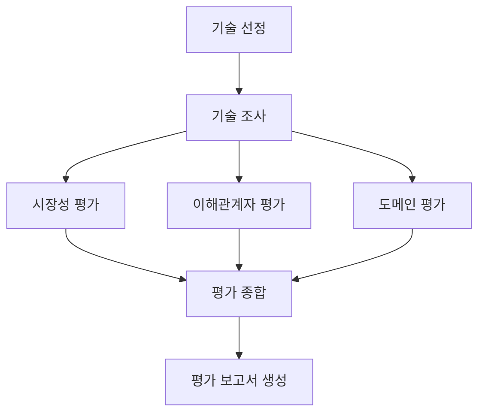

# KV Cache 최적화 기술 다관점 평가 Agentic RAG

본 프로젝트는 KV cache 최적화 기술을 소프트웨어(SW), 하드웨어(HW) 두 진영에서 선정하여,
시장성·이해관계자·도메인 관점에서 비교 평가하는 LangGraph 기반 Multi-Agent + Agentic RAG 입니다.

## Overview
- Objective: 하나의 병목(KV cache)을 상반된 방식으로 푸는 두 기술을 복수 관점에서 비교 평가
- Method: LangGraph Multi-Agent (fan-out/fan-in) + Agentic RAG
- Tools: LangGraph, LangChain, Chroma, HuggingFace Embeddings

## Selected Technologies
- SW : KIVI — 양자화 계열 대표 베이스라인, 공개 자료/구현체가 많아 RAG·시장·도메인 자료 확보 용이
- HW : ITME — CXL-Hybrid 메모리 기반 계층적 확장 아키텍처, Cloud/DC 도메인 적용성 평가에 적합

팀 논의 끝에 Human 기반(2안)으로 확정한 값이며 `candidates.py`의 `FINAL_SELECTION`에 반영되어
있습니다. 다른 조합을 실험하려면 `app.py` 실행 전 `initial_state`에 `selected_sw`/`selected_hw`를
직접 채우거나, `initial_state["auto_select"] = True`로 에이전트 기반 선정(1안)을 사용하세요.

## Features
- 논문 PDF 기반 RAG로 기술 개요/한계/TRL(기술성숙도) 추출 (기술조사 에이전트)
- 도메인 평가는 Memory Efficiency·Latency·Throughput·Quality·Infrastructure Requirement
  5개 세부 지표로 구조화 (Cloud/Data Center Long-context LLM Serving 기준)
- 이해관계자 에이전트는 RAG 대신 웹 검색 + 일반 지식으로 Cloud/DC 사업자, 개발자, HW/메모리
  업체, 서버 OEM, 투자업계 관점을 다룸
- 병렬(fan-out) 평가 후 평가종합 에이전트가 관점 간(TRL·시장성·이해관계자·도메인) 상충 지점을 정리
- 확증편향 방지: 우열 판정 금지를 모든 프롬프트에 명시, 관점별 에이전트 완전 분리

## Tech Stack
- Framework: LangGraph
- LLM/Generator: OpenAI (기본 `gpt-4o-mini`, `.env`의 `LLM_MODEL`로 교체 가능)
- Retrieval: Chroma (로컬, 논문별 collection 분리)
- Embedding: `BAAI/bge-m3` (오픈소스, 팀 최종 결정) — 한영 cross-lingual retrieval,
  최대 8192 토큰 지원, Dense/Sparse/Multi-vector 지원으로 향후 Hybrid Search 확장 가능
  (현재 구현은 `langchain_huggingface`를 통한 Dense 임베딩만 사용 — Sparse/ColBERT까지 쓰는
  완전한 Hybrid는 `FlagEmbedding`의 `BGEM3FlagModel` 연동이 필요한 향후 확장 범위)

## Directory Structure
```
├── data/                  # 선정 논문 PDF를 여기에 저장 (파일명은 candidates.py 참고)
├── agents/                # Agent 모듈 (선정/조사/시장/이해관계자/도메인/종합/보고서)
├── rag/                   # PDF 로딩 + 벡터스토어 구축/검색
├── prompts/               # 에이전트별 프롬프트 템플릿
├── outputs/               # 생성된 평가 보고서(.md) 저장
├── chroma_db/             # 벡터스토어 영속 저장 (자동 생성)
├── candidates.py          # Doc Pool 후보 기술 메타데이터
├── state.py               # LangGraph State 스키마
├── graph.py               # 그래프 구조 정의
└── app.py                 # 실행 스크립트
```

## Setup
```bash
pip install -r requirements.txt
cp .env.example .env   # OPENAI_API_KEY 채우기
```

선정된 논문 PDF를 `candidates.py`의 `file` 필드명대로 `data/`에 넣으세요.
(PDF가 없으면 자동으로 Doc Pool 요약으로 폴백하되, RAG 근거는 약해집니다.)

## Usage
```bash
python app.py
python app.py --domain "OnDevice AI"
```

## Agents
- 🔍 기술 조사 에이전트 (RAG): 선정 논문 원문에서 개요/접근/한계 + TRL(기술성숙도) 추출
- 📊 시장 평가 에이전트 (RAG): 원문 내 시장/채택 언급 + 일반 지식 보완
- 🤝 이해관계자 평가 에이전트 (No RAG): 웹 검색 + 일반 지식
- 🏭 도메인 평가 에이전트 (RAG): Cloud/DC Long-context Serving 5개 지표로 적합성 평가
- ⚖️ 평가 종합 에이전트: TRL·시장성·이해관계자·도메인 관점 간 공통점/상충점/시사점 정리
- 📝 보고서 생성 에이전트: SUMMARY~REFERENCE 구조의 최종 보고서 작성

## Architecture


## Contributors
- 오상현 : 기술 조사 에이전트 (RAG)
- 목진훈 : 시장 평가 에이전트 (RAG)
- 오지연 : 이해관계자 평가 에이전트 (No RAG)
- 이은서 : 도메인 평가 에이전트 (RAG)
- 이휘호 : 평가 종합 에이전트
- 이민서 : 보고서 생성 에이전트
