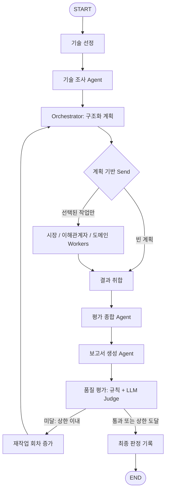

# Subject

본 프로젝트는 KV cache 최적화 기술을 소프트웨어·하드웨어 두 진영에서 선정하고,
시장·이해관계자·도메인 관점에서 비교 평가하는 **Orchestrator–Workers** 기반 프로젝트입니다.
공통 도메인은 Cloud/Data Center 환경의 Long-context LLM Serving이며,
특정 기술의 우열이나 도입 순위 대신 근거·적용 조건·trade-off를 설명합니다.

## Overview

- Objective: 각 기술을 복수 관점에서 평가하고 SW/HW 접근의 공통점·상충점·적용 조건을 비교합니다.
- Pattern: Orchestrator–Workers. 선행 기술 조사라는 의존성을 유지하면서 독립적인 관점 평가를 병렬 배분하고, 품질 미달 시 필요한 작업만 다시 계획하기 위해 선정했습니다.
- 동적 처리: LLM이 요청·기술 조사·capability registry·기존 결과·품질 피드백을 입력받아 구조화된 작업 목록을 State에 저장합니다. LangGraph `Send`는 이 계획만 읽어 실행 대상을 결정합니다.
- 초기에는 필수 세 관점의 커버리지 때문에 세 평가 Worker가 필요합니다. 재작업에서는 부족한 관점만 선택하거나 보고서 표현 문제만 있으면 빈 계획으로 Worker 실행을 생략할 수 있습니다.
- Trade-off: 선택적 재작업은 불필요한 반복을 줄이지만 Planner/Judge 비용·지연·비결정성이 추가됩니다. 현재 작업 단위는 관점별 SW/HW 전체 평가이며 세부 지표별 분할 실행은 지원하지 않습니다.

## Selected Technologies

- SW: **KIVI** — 비대칭 2-bit KV cache 양자화 접근을 대표합니다. 공개 논문·구현과 실험 자료가 있어 기술·시장·도메인 평가 근거 확보에 적합합니다.
- HW: **ITME** — CXL-hybrid 기반 계층형 원격 메모리 확장 접근을 대표합니다. Cloud/Data Center의 장문맥 LLM 서빙에서 용량·데이터 이동·운영 부담을 평가하기 적합합니다.
- 선정 방식: 팀의 Human-based 선정값을 `candidates.py`에 정의했습니다. 기술 선정과 실행 중 Worker 선택은 서로 다른 단계입니다.
- 두 기술의 실험 환경과 지표가 다르므로 논문 수치를 동일 조건의 직접적인 성능 순위로 해석하지 않습니다.

## Features

- PDF 기반 정보 추출: 기술 원문, 시장 보조 자료, 도메인 참고 논문을 파싱하고 출처·페이지·절 등 메타데이터를 유지합니다.
- 기술 조사: Abstract/Conclusion 고정 포함, 필드별 multi-query·RRF, 미확인 항목 최대 1회 재검색으로 개요·접근·한계·TRL 근거를 정리합니다.
- 동적 계획: 작업 ID·Worker·지시·선택 이유·회차를 구조화합니다. 미등록 Worker, 중복 작업, 필수 관점 누락, 재작업 ID 변경을 검증합니다.
- 계획 보정: 잘못된 계획은 한 번 보정 요청하며 두 번 실패하면 고정 실행 목록으로 대체하지 않고 오류로 종료합니다.
- 병렬 평가: 시장·이해관계자·도메인 평가가 독립 결과를 반환합니다. Worker 간 직접 호출 없이 조정 계층이 배분·취합합니다.
- 실패 fallback: 평가 Worker 오류 시 이전 결과 또는 판단 유보로 계속 진행하고 품질 평가에 실패 상태를 전달합니다. 선행 기술 조사 실패는 실행 오류로 종료합니다.
- 확증 편향 방지 전략: 동일한 관점별 기준 적용, 사실·추론·불확실성 구분, 한계·반대 근거 검토, 조건이 다른 실험 수치의 직접 비교 제한, 중립적 종합 및 Judge의 편향 통제 검사.
- 보고서 품질 평가: 보고서 생성 후 목차·인용 ID 규칙 검사와 LLM Judge를 결합하여 Groundedness·중립성·편향 통제·네 관점 커버리지를 평가합니다. 출처 ID가 있다는 이유만으로 근거 충실성을 통과시키지 않습니다.
- 품질 미달 루프: 피드백을 Orchestrator에 전달하고 보완·종합·보고서 재생성·재평가를 수행합니다. 기본 재작업 상한은 2회이며, 상한 종료는 품질 통과와 구분합니다.
- 출처 통제: 본문 인용을 검증하고 코드가 REFERENCE를 생성합니다. 현재 `data/`에 있는 프로젝트 입력 PDF도 참고문헌에 포함하므로 모든 REFERENCE 항목이 본문 인용 자료라는 뜻은 아닙니다.
- 실행 관측: 로컬 trace·검색 근거·품질 판정 파일과 선택적으로 LangSmith tracing을 제공합니다.

## Tech Stack

- Framework: LangGraph, LangChain
- LLM/Generator: OpenAI `gpt-5-mini` 기본값. `LLM_MODEL`로 변경 가능하며 Planner·평가·종합·보고서에서 공용 팩토리를 사용합니다.
- LLM/Judge: 같은 `get_llm()` 팩토리의 모델, `temperature=0` 요청과 Pydantic 구조화 출력 사용. 별도 Judge 전용 모델 설정은 없습니다.
- 이해관계자 LLM: 공용 모델의 사본에 낮은 reasoning effort 적용. `STAKEHOLDER_REASONING_EFFORT` 기본값은 `low`입니다.
- Retrieval: FAISS, Dense Top-K 및 보완 검색 시 Query Transformation + RRF
- Embedding: 오픈소스 `BAAI/bge-m3` 기본값, `EMBEDDING_MODEL`로 변경 가능. 현재 CPU에서 Dense embedding만 사용하며 Sparse·Multi-vector 검색은 미구현입니다.
- PDF Parsing: PyPDFLoader 및 절·표·알고리즘을 고려한 청크 구성
- 선택적 웹 보완: Tavily
- Observability: LangSmith, 로컬 JSON/JSONL 실행 기록

### Retrieval 평가

한국어 질의 14개로 영문 논문을 검색하고, 검색된 단일 청크가 모든 gold keyword를 포함하면 적중으로 판정합니다.

| 전략                       | Strict Hit Rate@5 | MRR@5 |
| -------------------------- | ----------------: | ----: |
| Dense Top-K                |             0.857 | 0.702 |
| Query Transformation + RRF |             0.929 | 0.714 |

이는 키워드 기반 평가이며 의미적 관련성이나 보고서의 사실 정확성을 보장하지 않습니다.
질의 변환 결과는 LLM에 따라 달라질 수 있으므로 재실행 시 수치가 변할 수 있습니다.
평가 원문 파일은 로컬 생성물이며 저장소에 포함되지 않을 수 있습니다.

## Agents

| 계층 / Agent      | 역할                                                                   |
| ----------------- | ---------------------------------------------------------------------- |
| 기술 선정         | 팀의 선정값 KIVI·ITME를 입력으로 구성                                  |
| 기술 조사         | 논문 RAG로 기술 개요·접근·한계·TRL 근거 추출                           |
| Orchestrator      | 구조화된 계획 생성·검증, Send 배분, 재계획                             |
| 시장 Worker       | 시장 수요·상용화·생태계·경제성·도입 장벽 평가                          |
| 이해관계자 Worker | 기술 조사 기반 이해관계자별 이익·부담 분석, 필요한 경우 웹 보완        |
| 도메인 Worker     | 메모리·지연·처리량·품질·인프라 관점의 적합성과 근거 평가               |
| 결과 취합         | task_id별 결과를 모아 관점별 payload로 전달                            |
| Synthesizer       | 관점 간 공통점·상충점·시사점 집계                                      |
| 보고서 생성       | State의 분석 결과로 Markdown 본문 생성, 목차·인용 검증, REFERENCE 구성 |
| 품질 평가         | 생성된 보고서 규칙 검사와 LLM Judge 평가                               |
| 종료 처리         | 품질 통과 또는 상한 도달을 구분하여 종료                               |

`WORKER_CAPABILITIES`는 사용 가능한 능력 목록이고 자동 실행 지시가 아닙니다.
`WORKER_NODES`는 선택된 Worker 이름을 실제 함수에 연결하는 실행 registry입니다.

## State Schema

- 제어 vs 페이로드 분리: `plan`, `round_count/max_rounds`, `step_count/max_steps`, `eval_result`, `last_error`, `termination_reason` 등 제어 필드와 기술 조사·관점별 분석·종합·보고서 payload를 분리합니다.
- 관측성 위치: `run_id`와 계획의 `reason`, Worker 상태·오류·회차·근거 경로를 State에 보관하고 외부 `trace.jsonl`에 기록합니다. LangSmith도 환경 설정으로 활성화합니다.
- 지속성 비용: 검색 원문은 외부 evidence JSON에 저장합니다. State에는 경로와 최신 작업 결과를 유지하고, 전체 계획 이력은 외부 trace로 확인합니다.
- 상관: 동일 `run_id`를 출력 폴더, trace, LangGraph `thread_id`, LangSmith metadata에 연결합니다. `task_id`는 계획과 결과를 연결하며 재작업 시 유지합니다.
- 재개/복구: `build_graph(checkpointer=...)`로 checkpointer를 주입할 수 있습니다. CLI의 InMemorySaver는 프로세스 내 체크포인트만 보관하며 프로세스 재시작 후 복구나 CLI resume 기능은 구현하지 않았습니다.
- 동시 처리: `worker_results`의 reducer가 task_id별 결과를 병합합니다. 서로 다른 작업 결과를 누적하고 동일 ID의 재작업 결과만 갱신합니다. 별도의 전역 State 키에 대한 병렬 직접 쓰기를 피합니다.
- 종료 보장: 품질 라우터에서 기본 `max_rounds=2`, `max_steps=12`를 검사하고 그래프는 `recursion_limit=60`을 사용합니다. step_count는 전체 노드 수가 아니라 제어 단계 계수입니다. 이는 그래프 반복 제한이며 외부 API 응답 시간 자체의 보장은 아닙니다.

## Architecture

GitHub에서 아래 Mermaid 그래프를 다이어그램으로 확인할 수 있습니다.


```mermaid
flowchart TD
    START([START]) --> SELECT[기술 선정]
    SELECT --> RESEARCH[기술 조사 Agent]
    RESEARCH --> PLAN[Orchestrator: 구조화 계획]
    PLAN --> DISPATCH{계획 기반 Send}
    DISPATCH -->|선택된 작업만| WORKERS[시장 / 이해관계자 / 도메인 Workers]
    DISPATCH -->|빈 계획| COLLECT[결과 취합]
    WORKERS --> COLLECT
    COLLECT --> SYNTH[평가 종합 Agent]
    SYNTH --> REPORT[보고서 생성 Agent]
    REPORT --> QUALITY[품질 평가: 규칙 + LLM Judge]
    QUALITY -->|미달: 상한 이내| REWORK[재작업 회차 증가]
    REWORK --> PLAN
    QUALITY -->|통과 또는 상한 도달| FINISH[최종 판정 기록]
    FINISH --> END([END])
```

기술 선정·조사·종합·보고서 생성 순서는 의존성에 따라 고정됩니다.
동적 부분은 계획에 따른 Worker 실행 대상·작업 지시·개수와 품질 피드백에 따른 재배분입니다.

## Directory Structure

```text
├── data/                  # 기술 원문·시장 자료·도메인 참고 PDF
├── agents/                # 선정·조사·Workers·Orchestrator·종합·보고서·품질 평가
├── prompts/               # Agent별 프롬프트·평가 기준
├── rag/                   # PDF 적재·검색·질의 변환·Retrieval 평가
├── tools/                 # 선택적 웹 검색 도구
├── tests/                 # 계획·품질·근거·보고서·출처 검증
├── outputs/               # 로컬 실행 trace·근거·품질 판정·보고서
├── faiss_index/           # 자동 생성되는 검색 인덱스
├── app.py                 # 실행 스크립트
├── graph.py               # LangGraph 노드·조건부 라우팅·Send 연결
├── state.py               # State 스키마·동시성 reducer
├── candidates.py          # 후보 및 팀 선정값
├── llm.py                 # LLM·Embedding 팩토리
├── requirements.txt       # 의존 패키지
└── README.md
```

## Usage

### 환경 준비

Python 3.11을 권장합니다. 프로젝트 루트에서 실행하세요.

```bash
python3.11 -m venv .venv
source .venv/bin/activate
pip install -r requirements.txt
```

기존 `.venv`가 있다면 생성 단계를 생략합니다.
프로젝트 루트의 `.env`에 필요한 값을 설정하세요. API 키와 `.env`는 커밋하지 않습니다.

```dotenv
OPENAI_API_KEY=your-openai-api-key
LLM_MODEL=gpt-5-mini
EMBEDDING_MODEL=BAAI/bge-m3
STAKEHOLDER_REASONING_EFFORT=low
TAVILY_API_KEY=your-tavily-api-key

LANGSMITH_TRACING=true
LANGSMITH_API_KEY=your-langsmith-api-key
LANGSMITH_PROJECT=SKALA-Orchestrator-Workers
```

Tavily와 LangSmith는 해당 기능을 사용할 때 설정합니다.
LangSmith tracing은 자료와 응답을 외부 서비스로 전송하므로 민감한 입력은 주의해야 합니다.
`llm.py`가 `load_dotenv(override=True)`를 사용하므로 동일한 환경변수는 `.env` 값이 우선합니다.

### 문서 준비

```text
data/sw_kivi.pdf
data/hw_itme.pdf
data/market_hf_kv_cache.pdf
data/market_micron_amd_cxl_memory_expansion.pdf
data/PagedAttention.pdf
data/DistServe.pdf
data/LongBench.pdf
```

핵심 원문이 없으면 기술 조사에서 후보 메타데이터 요약으로 fallback할 수 있으나,
이를 정상적인 PDF 근거 기반 검증과 동일하게 해석하면 안 됩니다.

### 실행

```bash
python app.py --domain "데이터센터/클라우드 서빙"
```

실제 API 비용이 발생하며 CPU 임베딩·검색·LLM 평가에 시간이 걸릴 수 있습니다.

### 테스트 및 검색 평가

```bash
python -m unittest tests.test_orchestration tests.test_quality tests.test_evidence tests.test_tech_research tests.test_report tests.test_references
python -m rag.evaluate --k 5
```

Mock 테스트 통과는 실제 LLM 선택이나 전체 실행의 품질 통과를 의미하지 않습니다.
Retrieval 평가는 실제 검색과 질의 변환을 사용합니다.
기존 `test_ingest`, `test_synthesis`의 API 정합성은 별도로 확인해야 하므로 전체 discover 통과를 보장하지 않습니다.

### 결과 확인

- `outputs/report_YYYYMMDD_HHMMSS.md`: 기술 평가 보고서
- `outputs/<run_id>/trace.jsonl`: 계획·Worker 상태·품질 판정·종료 이유
- `outputs/<run_id>/*_evidence.json`: 검색 근거 발췌
- `outputs/<run_id>/quality.json`: 최종 품질 평가 결과
- `outputs/rag_eval_*.md`: Retrieval 평가 결과

보고서 생성 → 품질 평가 → 필요 시 재작업 → 종료 순서입니다.
현재 보고서 양식은 0. SUMMARY부터 7. REFERENCE까지의 기술 평가 목차입니다.
패턴·State 설계는 이 README에서, 실제 계획 이력과 최종 판정은 trace·quality.json에서 확인합니다.
품질 미달 상한 종료 시 보고서에 품질 평가 한계를 추가합니다.
설계 설명·실행 이력·최종 판정을 보고서 안에 모두 포함하는 양식은 추가 구현이 필요합니다.
자동 출력은 Markdown이며 PDF 제출이 요구되면 별도 변환 후 페이지 수·표·인용을 검수합니다.

LangSmith에서는 설정한 프로젝트의 `orchestrator-workers` 실행을 열고
Orchestrator 출력의 `plan`, 공통 Worker 입력의 `task.worker`,
품질 판정과 재작업 흐름을 확인합니다.
중단된 실행은 최종 보고서나 quality.json 없이 일부 trace만 남을 수 있습니다.
실제 동적 동작 실증에는 선택적 재작업이 확인되는 실행 기록이 필요합니다.

## Contributors

| 담당자 | 담당                                                          |
| ------ | ------------------------------------------------------------- |
| 오상현 | 기술 조사 Agent, Agent 설계                                   |
| 목진훈 | 시장 평가 Agent, Agent 설계, state 설계                       |
| 오지연 | 이해관계자 평가 Agent, Agent 설계, LangGraph 연동             |
| 이은서 | 도메인 평가 Agent, Agent 설계, Orchestrator 개발, Worker 연동 |
| 이휘호 | 평가 종합 Agent, Agent 설계, 품질 평가, 테스트 진행           |
| 이민서 | 보고서 생성 Agent, Agent 설계, Worker 연동                    |
